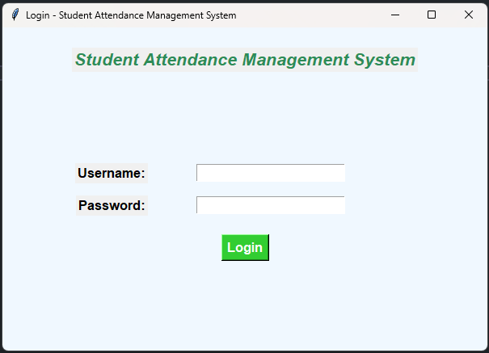

# 🎓 Student Attendance Management System

A desktop-based **Student Attendance Management System** built with **Python (Tkinter)** for the GUI and **Microsoft SQL Server** for the backend database.  
This project enables educational institutions (schools, colleges, coaching centers) to **manage student records, mark attendance, and generate reports** in a streamlined manner.

---

## 📌 Table of Contents
1. [Overview](#overview)
2. [Key Features](#key-features)
3. [Tech Stack](#tech-stack)
4. [Screenshots](#screenshots)
5. [Database Schema](#database-schema)
6. [Repository Structure](#repository-structure)
7. [Setup Instructions](#setup-instructions)
8. [How to Run](#how-to-run)
9. [Usage Guide](#usage-guide)
10. [Troubleshooting](#troubleshooting)
11. [Future Improvements](#future-improvements)
12. [License](#license)

---

## 📖 Overview
Manually handling student attendance is time-consuming and prone to errors.  
This system provides a **simple, user-friendly interface** to record attendance digitally.  

- Designed with **role-based access** (`Admin` and `Teacher`) to secure operations.
- Uses **Tkinter** for a lightweight graphical interface.
- Data is **stored centrally** in a Microsoft SQL Server database.
- Includes **basic reporting features** to view attendance trends.

---

## ✨ Key Features
- 🔐 **Login Authentication**
  - Role-based login system with sample users (`admin`, `teacher`).
- 👩‍🎓 **Student Management**
  - Add, update, and remove student records with roll number and class.
- 📅 **Attendance Management**
  - Mark daily attendance (Present/Absent).
- 📊 **Reports & Analytics**
  - Generate attendance reports by date, class, or student.
  - Admins can view **attendance trends**.
- 🖼 **User Interface**
  - Clean Tkinter-based UI with background images and icons.
- 💾 **Database Integration**
  - Persistent storage using Microsoft SQL Server.
- 🛠 **Extensible**
  - Code is modular (separate files for auth, students, attendance, reports).

---

## 🛠 Tech Stack
- **Programming Language:** Python 3.x  
- **GUI Framework:** Tkinter  
- **Database:** Microsoft SQL Server (works with SQL Server Express)  
- **Database Driver:** [pyodbc](https://github.com/mkleehammer/pyodbc)  
- **Libraries:**
  - `tkinter` (standard Python GUI)
  - `Pillow` (`PIL`) for handling images

---

## 🖼 Screenshots
*(Add screenshots of your running app here – login screen, dashboard, attendance form, reports, etc.)*

| Login Page | Dashboard |
|------------|-----------|
|  |  |

---

## 🗄 Database Schema
The project includes a **SQL script** (`student_attendance.sql`) that:
- Creates the database `student_attendance`
- Defines three tables:
  - `students` – student details
  - `attendance` – attendance records
  - `users` – login credentials with role (`admin` or `teacher`)
- Inserts sample users:
  - **admin / adminpass**
  - **teacher / teacherpass**

